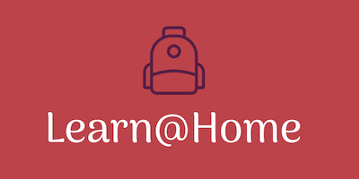

# **Definissez-les-besoins-pour-une-app-de-soutien-scolaire**

Livrables du projet OpenClassrooms n°10

Learn@Home - Définissez les besoins pour une app de soutien scolaire

## Objectifs principaux : 
* Contribuer à un projet en utilisant une méthodologie agile
* Créer une maquette pour un client
* Identifier les besoins de l'application à partir d'un cahier des charges
* Modéliser une solution technique pour un client

### **📦 Les livrables**

1. [**Diagramme de cas d'usage**](https://github.com/ZhannaZucher/Definissez-les-besoins-pour-une-app-de-soutien-scolaire/blob/main/Use%20Case%20Diagrams%20Learn%40Home.pdf)
2. [**User stories**](https://github.com/ZhannaZucher/Definissez-les-besoins-pour-une-app-de-soutien-scolaire/blob/main/User%20Stories%20Learn%40Home.pdf)
3. [**Maquettes desktop et mobile** sur *Figma*](https://www.figma.com/file/QISJ8GotOy9m2hRZZN3GUH/Projet-10-Learn%40Home-Zhanna-Zucher?type=design&node-id=1%3A88&t=xM5D3ndtwaiUB3eZ-1)
4. [**Kanban**](https://github.com/users/ZhannaZucher/projects/1)

